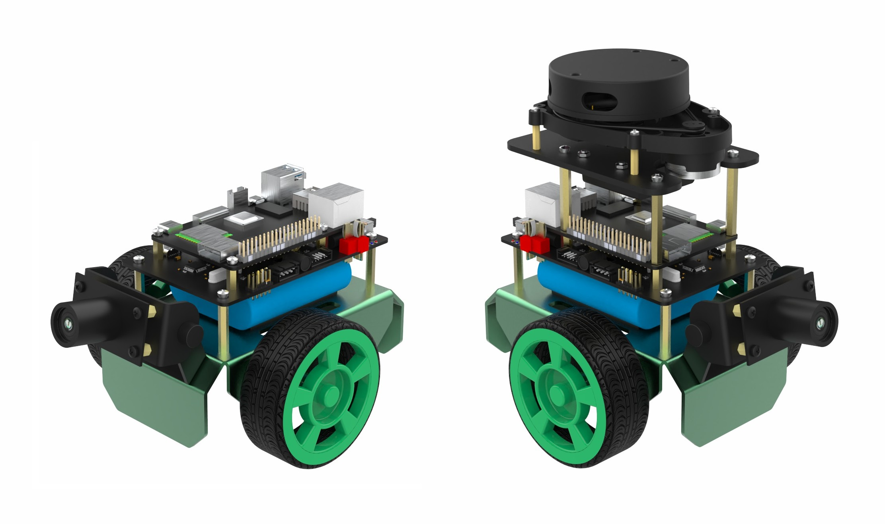

# OriginBot Open Source Intelligent Robot Suite (Controller Source Code Repository)

OriginBot is an open-source intelligent robot suite and a community-driven open-source project aimed at enabling every participant to enjoy the fun of robot development.

## Project Links

### Main Website

[https://www.originbot.org/](https://www.originbot.org/)

### Source Code Repositories

| Repository                                                      | Description                     |
| --------------------------------------------------------------- | ------------------------------- |
| [originbot](https://github.com/guyuehome/originbot)              | OriginBot robot-side function package repository |
| [originbot_desktop](https://github.com/guyuehome/originbot_desktop) | OriginBot desktop-side function package repository |
| [originbot_controller](https://github.com/guyuehome/originbot_controller) | OriginBot controller source code repository |

### Community Forum

[https://guyuehome.com/Bubble/circleDetail/id/95](https://guyuehome.com/Bubble/circleDetail/id/95)

## Software Architecture

- firmware: Precompiled controller firmware
- material: Electrical schematics, communication protocols, and other resources
- source: Controller source code project
- tools: Tools related to the controller

## Contributing

We sincerely invite developers to participate in the OriginBot project. There are many ways and forms to contribute:

### **Provide Feedback**

- If you encounter any issues or have suggestions while using the OriginBot suite, feel free to discuss them in the [Guyuehome Community Forum](https://guyuehome.com/Bubble/circleDetail/id/95);
- If you discover any bugs while using the OriginBot software, please submit an Issue in the [code repository](https://gitee.com/guyuehome/originbot);

### **Contribute Code**

- If you have optimizations, additions, or modifications to the native code while using the OriginBot suite, feel free to submit a Pull Request in the [code repository](https://gitee.com/guyuehome/originbot);

### **Spread Open Source**

- If you are interested in OriginBot, feel free to star the project's source code repository or share it with developers who might need it;
- If you create more interesting features or robots based on the OriginBot open-source project, feel free to share them in the [community forum](https://guyuehome.com/Bubble/circleDetail/id/95). Outstanding projects will also be promoted in the community.
